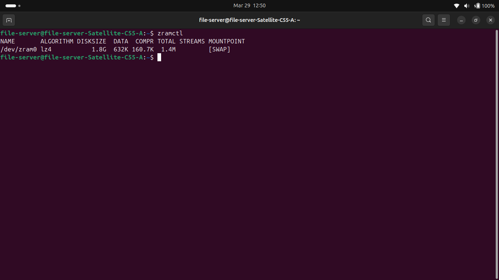
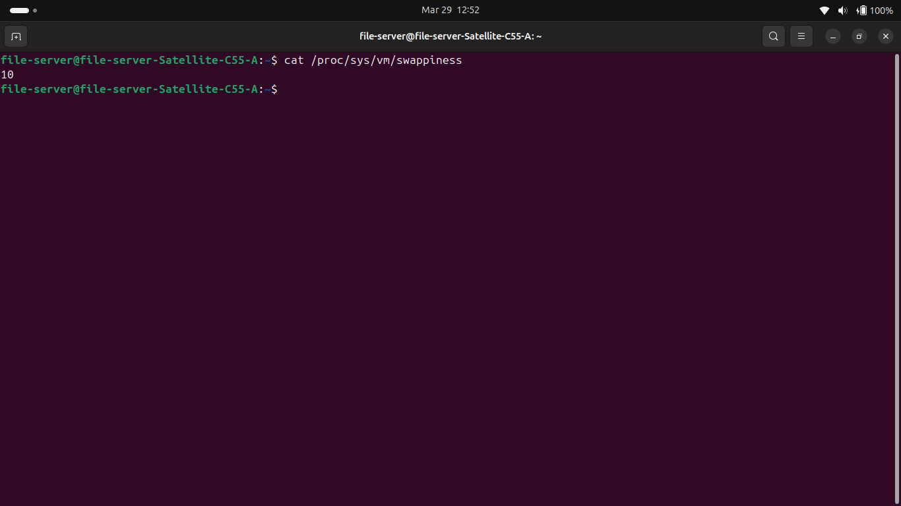
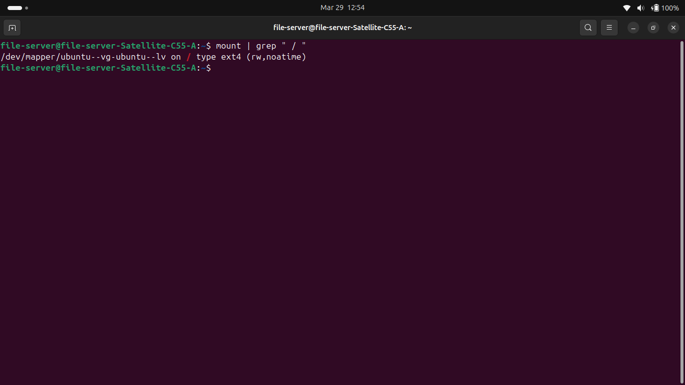
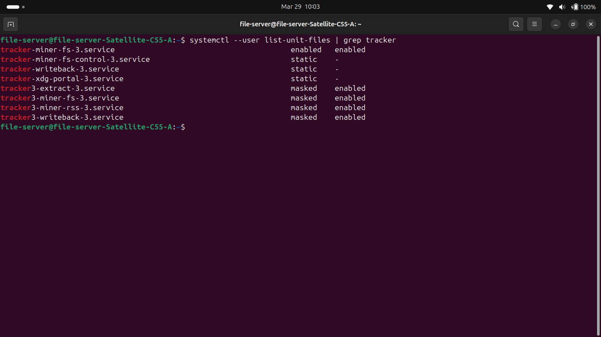
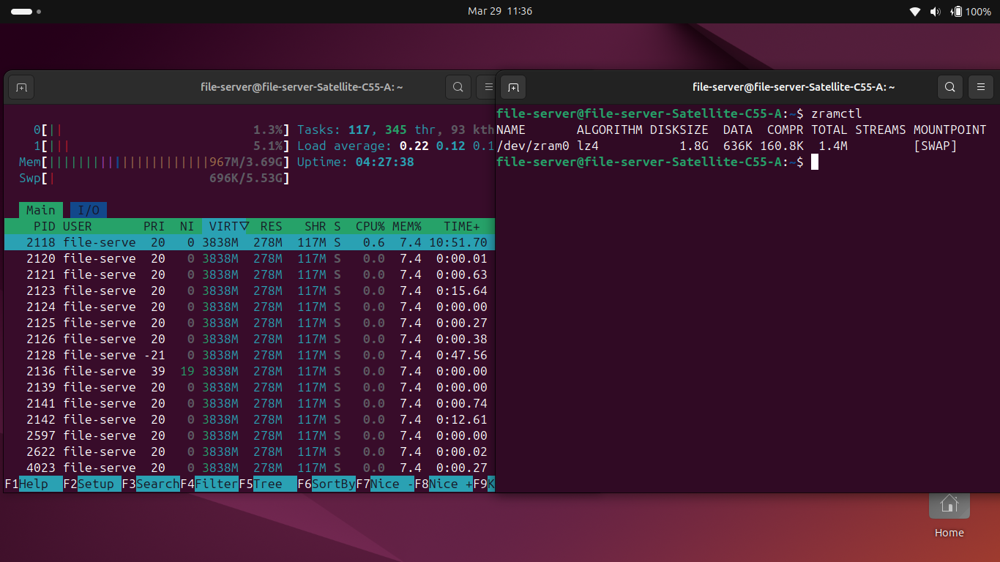
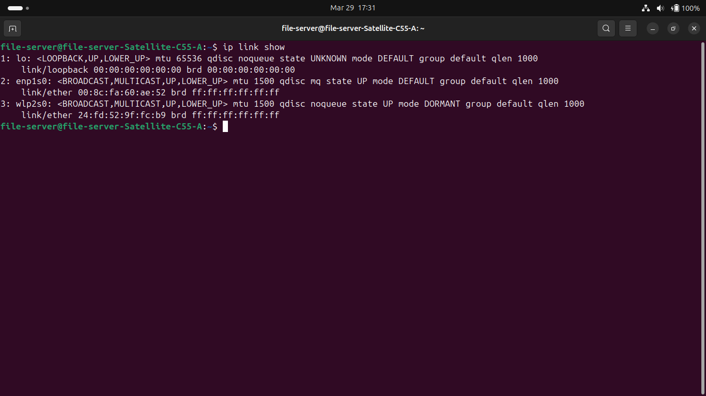

# **Ubuntu File Server Project**
## Objective:
To deploy Ubuntu Desktop on a repurposed Toshiba Satellite C55 laptop as a local network accessible file server. The server will use Samba for file sharing compatibility with Windows and OpenSSH for secure remote administration from a Windows 11 client machine, utilizing SSH keys over passwords for enhanced security.
## Business Related Scenario:
This project simulates a small office environment where a dedicated file server provides centralized storage and secure remote administration for client machines, allowing users to share files seamlessly and manage the system efficiently from a Windows workstation.
## Environment:
- **Server Hardware:** Toshiba Satellite C55, 4GB DDR3 RAM, Seagate Barracuda HDD
- **Client Machine:** Windows 11 Laptop
- **Server OS:** Ubuntu Desktop 24.04.4 LTS
- **Purpose:** Hands-on Linux server administration and remote management.

## Network Infrastructure & Interoperability:
- **Dual Interface Architecture (Hybrid Networking)**:
- **Primary (Data Plane)**:
- Dedicated 5e copper link for high-throughput SMB/Samba traffic, ensuring low latency file access for the Windows client.

- **Secondary (Management Plane)**: 
- 802.11n Wireless interface acting as a redundant failover, providing persistent SSH management access if the physical copper link is compromised or disconnected.

- **Protocol & Resolution Standards**:

- **Addressing**: 
- Fixed static Ipv4 assignment via *netplan* to prevent service delivery failure (DNS/DHCP lease expiration).

- **Name Resolution**:
- Implementation of **mDNS** and **LLMNR** to allow hostname-based UNC pathing from the Windows environment, bypassing the need for a dedicated DNS server.

- **Client-Side Security Interop**:
- **Windows 11 (24H2) Hardening**: Configured local SMB Client policies to support encrypted signing requirements while allowing modern authentication handshakes with the Linux Samba daemon.

- **Access Control**:
Role-Based Access Control (RBAC) simulation using discrete Samba user accounts (*kel_admin*) VS (*staff*) to demonstrate the principle of Least Privilege (PoLP)


## Skills Demonstrated:
- Linux installation and configuration
- Static IP addressing
- Samba file server setup
- SSH key based authentication
- Remote server administration from Windows
## Project Steps:
### Step 1 - Ubuntu Desktop Installation
**Method:** Booted from a Ventoy multi-boot USB containing the Ubuntu Desktop ISO image.

**Process:** 
- Inserted Ventoy USB, booted up into the Toshiba Satellite C55's BIOS, changed the boot order/priority to the Ventoy USB and booted into Ventoy
- Selected Ubuntu Desktop ISO from the Ventoy boot menu
- Followed the Ubuntu installation wizard
- Created a local user account during setup
- Completed installation and rebooted into Ubuntu Desktop

**Outcome:** Ubuntu Desktop successfully installed and booting normally.

**OS selected:** Ubuntu Desktop 24.04.04 LTS chosen for its long term 
support stability and suitability for a server environment.

### Step 2 - Service Installation & System Optimization
After updating all system packages, the server was optimized to operate efficiently within the constraints of a mechanical HDD and 4GB of RAM. This phase focused on improving system responsiveness, reducing unnecessary disk I/O, and ensuring stable performance under load.

**Services Installed:**
- **OpenSSH & Samba:** Installed to allow remote CLI management and cross-platform file sharing.
- **Verification**:
```Bash
systemctl status ssh smbd
# Should show active (running) and (enabled)
```


**Hardware Optimizations:**
- **ZRAM Implementation:** A compressed RAM swap was initialized using the **LZ4 algorithm.** This creates a high-speed buffer, preventing the system from "thrashing" the slow physical HDD when memory usage spikes.
- **Validation:**
```Bash
 zramctl 
# Confirmed /dev/zram0 is active with 1.8G disk size
 ```
 
- **Virtual Memory Optimization:** The *vm.swappiness* parameter was reduced from 60 to **10.** This instructs the kernel to prioritize physical RAM/ZRAM, only utilizing the HDD swap as a last resort.
- **Validation:** 
```Bash
cat /proc/sys/vm/swappiness 
# Output:10
```

- **Filesystem Metadata Reduction:** The root partition was remounted with the ***noatime*** flag. This eliminates unnecessary disk writes during file "read" operations, preserving HDD bandwidth for actual data transfers.
- **Validation:** 
```Bash
mount | grep " / " 
# Look for 'noatime' in the mount options parentheses
```

- **Background Indexing Deactivation:** The **Tracker3** suite (system-wide file indexing) was masked to reclaim more available RAM and stop background disk grinding.
- **Validation:**
```Bash
 systemctl --user list-unit-files | grep tracker 
 # Status should show 'masked' for all miner/extractor services
 ```
 
### **Resource Baseline (Post-Optimization)**
**Monitoring:** Utilized *htop* to establish a performance baseline, verifying that background I/O wait is minimized and ZRAM is handling memory pressure efficiently.

**Observed Results:**
- **RAM Usage:** 950MB/3.69GB at idle
- **Swap:** ZRAM active, minimal HDD swap utilization
- **CPU:** Low idle usage confirming background processes are minimal
- **I/O Wait:** Minimal, confirming noatime and Tracker3 masking are effective


**Conclusion:** The optimized configuration demonstrates efficient resource 
utilization suitable for sustained file server operation on legacy hardware.

### Step 3 - Configuring Networking & Samba
This phase establishes a high-availability network identity for the server and implements Role-Based Access Control (RBAC) to secure business data.

**1.Network Foundation**:
Used the ip link show command to identify the hardware interfaces available for the server. This is the first step in establishing a dual-homed configuration for network redundancy.
- **Verification & Validation**:
```Bash
ip link show
# Identify "en" (Ethernet) and "wl" (Wi-Fi) interfaces.
```


**2.Implementing Redundant Ip Static Addressing (Netplan)**:
To ensure the system maintains a consistent network identity for Samba shares and administrative access, I configured Ipv4 static addresses on both interfaces using Netplan.

- **Architecture & Logic**:

- **Renderer Specification**:
Changed the renderer to *NetworkManager* to resolve a conflict between the Ubuntu Desktop GUI and the backend *systemd-networkd* services.

- **Primary Interface (enp1s0)**: Configured with *192.168.40.200/24* and a **Metric of 100** to designate it as the preferred path.

- **Failover Interface (wlp2s0)**: Configured with *192.168.40.201/24* and a **Metric of 600** to act as a floating static route.

- **DNS Strategy**: Implemented manual *nameservers* (8.8.8.8, 1.1.1.1) to ensure resolution persistence independent of ISP-provided DHCP settings.

**3. Routing & Resolver Troubleshooting**:
During the implementation, a "No Scopes" error was identified on the wireless interface, preventing DNS resolution despite a valid IP assignment.

- **Diagnosis**: Used resolvectl status and ip route to identify that the system resolver was not correctly binding to the NetworkManager-managed interface.

- **Resolution**:

Corrected the symbolic link for the system resolver: *sudo ln -sf /run/systemd/resolve/stub-resolv.conf /etc/resolv.conf.*

Forced a global DNS domain mapping for the wireless link: *sudo resolvectl domain wlp2s0 ~.*

Verified Layer 3 end-to-end connectivity using interface-specific ICMP tests (*ping -I wlp2s0 -c 4 8.8.8.8*).

**Post-Implementation Validation**:

Verified the redundant routing table, DNS resolver status and interface-specific connectivity to ensure high availability.

```Bash
# Commands executed for validation:
ip route | grep default
resolvectl status wlp2s0
ping -I wlp2s0 -c 5 google.com
```


