# **Ubuntu File Server Project**
## Objective

Deploy Ubuntu Desktop on a repurposed Toshiba Satellite C55 laptop as a local network-accessible file server. The server uses Samba for Windows file sharing and OpenSSH for secure remote administration from a Windows 11 client, using SSH key-based authentication instead of password logins.

## Business Scenario
This project simulates a small office environment where a dedicated file server provides centralized storage and secure remote administration for client machines. Users can share files seamlessly and manage the system efficiently from a Windows workstation.
## Environment
- **Server Hardware:** Toshiba Satellite C55, 4GB DDR3 RAM, Seagate Barracuda HDD  
- **Client Machine:** Windows 11 Laptop  
- **Server OS:** Ubuntu Desktop 24.04.4 LTS  
- **Purpose:** Hands-on Linux server administration and remote management

## Network Infrastructure & Interoperability
### Dual Interface Configuration (Ethernet + Wi-Fi Failover)
- **Primary (Data Plane):** Dedicated Cat5e copper link for high-throughput SMB/Samba traffic, ensuring low-latency file access.  
- **Secondary (Management Plane):** 802.11n wireless interface providing persistent SSH management access if the physical copper link is unavailable.

### Protocol & Resolution Standards
- **Addressing:** Fixed static IPv4 assignment via Netplan to prevent service disruption caused by DHCP lease changes.  
- **Name Resolution:** Implemented mDNS and LLMNR to allow hostname-based UNC pathing from Windows, bypassing the need for a dedicated DNS server.

### Network Diagram
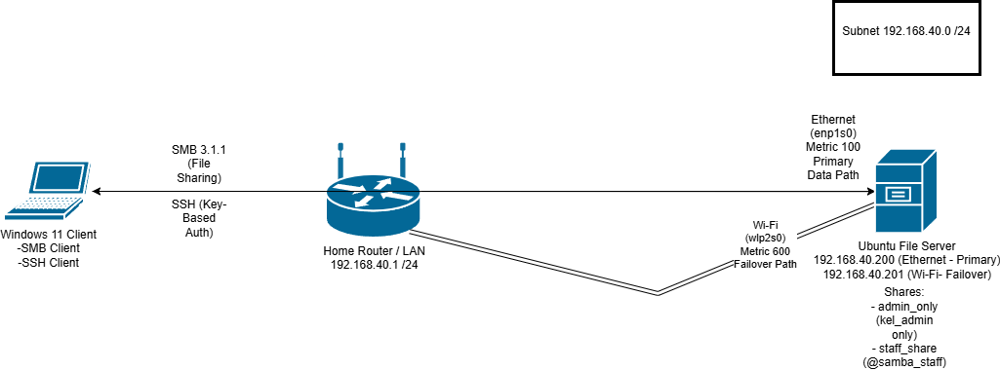

**Resolution Strategy & Final Implementation:**  
While mDNS (Avahi) was configured on Ubuntu, hostname resolution from Windows 11 proved inconsistent due to client-side firewall policies and OS security restrictions. To ensure deterministic and reliable access, implementation transitioned to **Direct IP Addressing**, which mirrors enterprise best practices.

**Design Decision**:
To ensure deterministic and reliable access to services, the implementation was transitioned to Direct IP Addressing.

- **Justification**:
This approach aligns with enterprise and data center environments, where:

- Services rely on static addressing or DNS records  
- Broadcast-based discovery is avoided due to unreliability and security concerns

**Outcome**:
Guaranteed service accessibility with zero dependency on local network discovery mechanisms.

- **Client-Side Security Interop**:
- **Windows 11 (24H2) Hardening**: Configured local SMB Client policies to support encrypted signing requirements while allowing modern authentication handshakes with the Linux Samba daemon.

- **Access Control**:
Basic role separation using Samba user accounts to demonstrate the principle of least privilege (PoLP).


## Skills Demonstrated
- Linux installation and configuration  
- Static IP addressing  
- Samba file server setup  
- SSH key-based authentication  
- Remote server administration from Windows
## Project Steps:
### Step 1 - Ubuntu Desktop Installation
**Method:** Booted from a Ventoy multi-boot USB containing the Ubuntu Desktop ISO.  

**Process:**  
- Inserted Ventoy USB, booted the Toshiba Satellite C55 BIOS, changed boot priority to USB.  
- Selected Ubuntu Desktop ISO from Ventoy boot menu.  
- Followed installation wizard and created a local user account.  
- Rebooted into Ubuntu Desktop.  

**Outcome:** Ubuntu Desktop installed successfully.  

**OS Selection:** Ubuntu Desktop 24.04.4 LTS for long-term support stability and server suitability.

### Step 2 - Service Installation & System Optimization
After updating all system packages, the server was optimized to operate efficiently within the constraints of a mechanical HDD and 4GB of RAM. This phase focused on improving system responsiveness, reducing unnecessary disk I/O, and ensuring stable performance under load.

**Services Installed:**
- **OpenSSH & Samba:** Installed to allow remote CLI management and cross-platform file sharing.
- **Verification**:
```Bash
systemctl status ssh smbd
# Should show active (running) and (enabled)
```


**Hardware Optimizations:**
- **ZRAM Implementation:** A compressed RAM swap was initialized using the **LZ4 algorithm.** This creates a high-speed buffer, preventing the system from "thrashing" the slow physical HDD when memory usage spikes.
- **Validation:**
```Bash
 zramctl 
# Confirmed /dev/zram0 is active with 1.8G disk size
 ```
 
- **Virtual Memory Optimization:** The *vm.swappiness* parameter was reduced from 60 to **10.** This instructs the kernel to prioritize physical RAM/ZRAM, only utilizing the HDD swap as a last resort.
- **Validation:** 
```Bash
cat /proc/sys/vm/swappiness 
# Output:10
```

- **Filesystem Metadata Reduction:** The root partition was remounted with the ***noatime*** flag. This eliminates unnecessary disk writes during file "read" operations, preserving HDD bandwidth for actual data transfers.
- **Validation:** 
```Bash
mount | grep " / " 
# Look for 'noatime' in the mount options parentheses
```

- **Background Indexing Deactivation:** The **Tracker3** suite (system-wide file indexing) was masked to reclaim more available RAM and stop background disk grinding.
- **Validation:**
```Bash
 systemctl --user list-unit-files | grep tracker 
 # Status should show 'masked' for all miner/extractor services
 ```
 
### **Resource Baseline (Post-Optimization)**
**Monitoring:** Utilized *htop* to establish a performance baseline, verifying that background I/O wait is minimized and ZRAM is handling memory pressure efficiently.

**Observed Results:**
- **RAM Usage:** 950MB/3.69GB at idle
- **Swap:** ZRAM active, minimal HDD swap utilization
- **CPU:** Low idle usage confirming background processes are minimal
- **I/O Wait:** Minimal, confirming noatime and Tracker3 masking are effective


**Conclusion:** The optimized configuration demonstrates efficient resource 
utilization suitable for sustained file server operation on legacy hardware.

### Step 3 - Configuring Networking
This phase establishes a resilient network configuration for the server.

**1. Network Foundation**:
Used the ip link show command to identify the hardware interfaces available for the server. This is the first step in establishing a dual-homed configuration for network redundancy.
- **Verification & Validation**:
```Bash
ip link show
# Identify "en" (Ethernet) and "wl" (Wi-Fi) interfaces.
```


**2. Implementing Failover IP Static Addressing (Netplan)**:
To ensure the system maintains a consistent network identity for Samba shares and administrative access, I configured IPv4 static addresses on both interfaces using Netplan due to the router being locked down by the ISP, preventing DHCP reservations from being configured.

- **Architecture & Logic**:

- **Renderer Specification**:
Changed the renderer to *NetworkManager* to resolve a conflict between the Ubuntu Desktop GUI and the backend *systemd-networkd* services.

- **Primary Interface (enp1s0)**: Configured with *192.168.40.200/24* and a **Metric of 100** to designate it as the preferred path.

- **Failover Interface (wlp2s0)**: Configured with *192.168.40.201/24* and a **Metric of 600** to act as a secondary route with higher metric for failover.

- **DNS Strategy**: Implemented manual *nameservers* (8.8.8.8, 1.1.1.1) to ensure resolution persistence independent of ISP-provided DHCP settings.

**3. Routing & Resolver Troubleshooting**:
During the implementation, a "No Scopes" error was identified on the 802.11n wireless interface, preventing DNS resolution despite a valid IP assignment.

- **Diagnosis**: Used resolvectl status and ip route to identify that the system resolver was not correctly binding to the NetworkManager-managed interface.

- **Resolution**:

Corrected the symbolic link for the system resolver: *sudo ln -sf /run/systemd/resolve/stub-resolv.conf /etc/resolv.conf.*

Forced a global DNS domain mapping for the wireless link: *sudo resolvectl domain wlp2s0 ~.*

Verified Layer 3 end-to-end connectivity using interface-specific ICMP tests (*ping -I wlp2s0 -c 5 8.8.8.8*).

**Post-Implementation Validation**:

Verified the failover routing table, DNS resolver status and interface-specific connectivity to ensure high availability.

```Bash
# Commands executed for validation:
ip route | grep default
resolvectl status wlp2s0
ping -I wlp2s0 -c 5 google.com
```


**Conclusion**: The completion of these configurations confirms that high-availability networking was successfully implemented. The server now has a reliable primary connection on Ethernet and a backup path on Wi-Fi that takes over automatically if a cable is pulled. This ensures the server maintains a consistent network presence, making services like Samba shares reliably accessible via IP address or hostname.

### **Step 4 - Samba Configuration & RBAC Validation**
With the networking foundation complete, it's time to configure Samba, create shared resources for LAN access, and define user permissions while verifying interoperability with the Windows client.

- **Creating User Accounts**:
Before creating Samba users, corresponding Linux user accounts must be created.
```Bash
sudo adduser kel_admin
sudo adduser staff_user
```
- **Verification & Validation**:
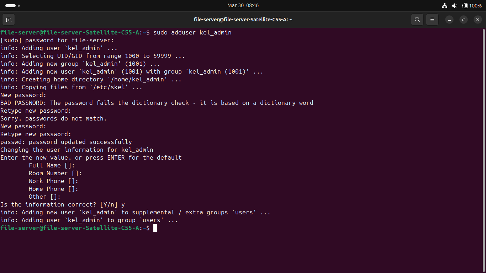
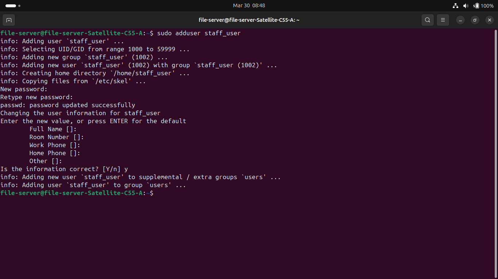

- **Creating Samba Users**:
With the Linux users created, I can now add them to the Samba authentication database.
```Bash
sudo smbpasswd -a kel_admin
sudo smbpasswd -a staff_user
```
- **Verification & Validation**:
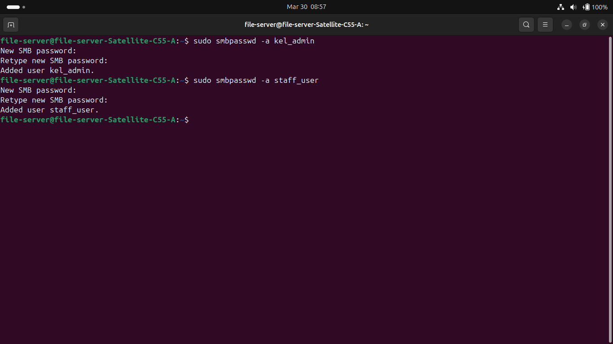

- **Creating The Physical Directory Structure**:
The parent and sub-directories will be created using the */srv/samba* root directory as it's a professional standard for shared data and prevents unintended permission exposure compared to using the */home* directory.
```Bash
# 1. Create the parent and sub-directories
sudo mkdir -p /srv/samba/admin_only
sudo mkdir -p /srv/samba/staff_share
# the -p tag creates the directory along with the directories that lead to the directory i'm creating

# 2. Create the 'samba_staff' group which is a Linux group for shared access control
sudo groupadd samba_staff

# 3. Add the 'staff_user' user to that group
sudo usermod -aG samba_staff staff_user
``` 

- **Verification & Validation**:


- **Configuring The Correct Permissions**:
 Samba access is governed by underlying Linux file system permissions, meaning effective access control must be configured at the OS level first.

```Bash
# Admin folder: only kel_admin can see this folder (700)
sudo chown kel_admin /srv/samba/admin_only
sudo chmod 700 /srv/samba/admin_only

# Staff folder: kel_admin owns it, but the staff group can work in it (770)
sudo chown kel_admin:samba_staff /srv/samba/staff_share
sudo chmod 770 /srv/samba/staff_share
```

- **Validation & Verification**:
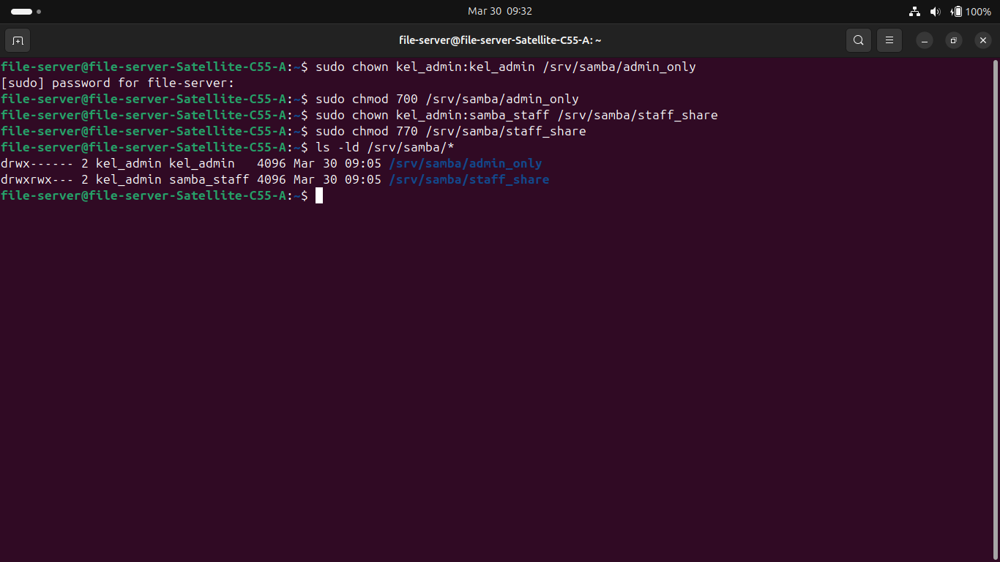

- **Reasoning**:
By configuring Linux file system permissions first, I am implementing a defense-in-depth approach. Even if the Samba service is misconfigured or compromised, the underlying OS enforces access restrictions.

- **Service Hardening & NetBIOS Configuration**:

Modified the global Samba configuration (/etc/smb.conf) to enforce modern security standards and ensure network visibility.

- **NetBIOS Resolution**: 

Defined netbios name = KEL-SERVER to resolve a 15-character naming warning and provide a consistent UNC path for Windows clients.

- **Verification & Validation**:
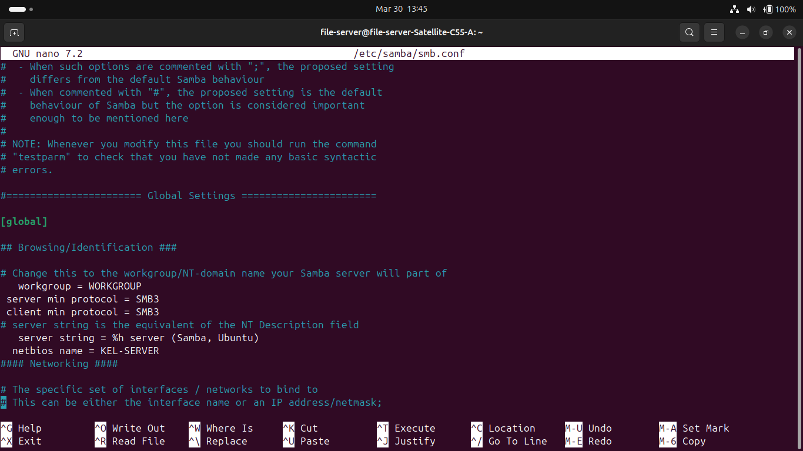

**Protocol Hardening**: Implemented server min protocol = SMB3 to disable legacy, insecure dialects. Verified the connection via Windows PowerShell (Get-SmbConnection), confirming a 3.1.1 dialect handshake.

- **Verification & Validation**:


- **Role-Based Access Control (RBAC) Logic**:
Configured the Samba shares to mirror the physical Linux permissions:

- **Admin-Internal**: Restricted to the kel_admin user.

- **Staff-Share**: Granted access to the @samba_staff group and kel_admin.

- **Force Modes**: Applied force create mode 0660 to ensure new files created via Windows maintain group-read/write parity.

- **Verification & Validation**:


- **Troubleshooting & Validation**
**Case Sensitivity/Syntax**: Identified a "Network Path Not Found" error caused by a hyphen mismatch in the UNC path (staff_share vs Staff-Share).
- **Proof**:
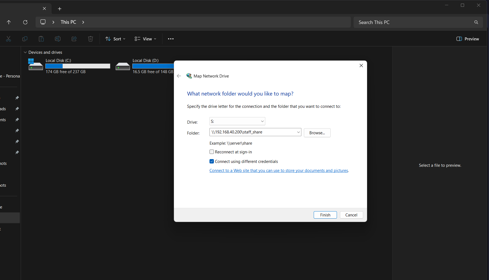

- **Group Membership**: Resolved an initial "Access Denied" error for the staff_user by verifying group membership via groups staff_user and Restarted the Samba service (systemctl restart smbd) to ensure updated group memberships were recognized by the daemon.

- **Success Metric**: Successfully mapped the S: Drive on a Windows 11 client and verified that the staff_user was denied access to the admin_only directory, confirming the Principle of Least Privilege (PoLP).

- **Verification & Validation**:
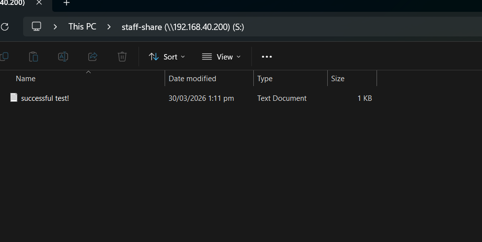
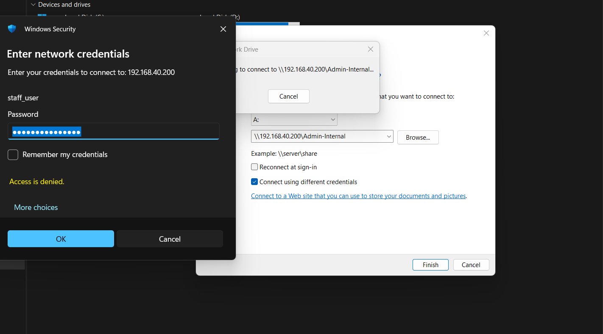

- **Lessons Learned**:

**Syntax Precision(The "Hyphen" Incident)**: One of the most critical takeaways was the absolute literalism of Network URI strings. A naming mismatch between the Linux directory (staff_share) and the Samba share definition (Staff-Share) resulted in a "Network Path Not Found" error. This reinforced the importance of standardizing naming conventions (e.g., always using hyphens or always using underscores) across a project.

The systemd "Brain" (Daemon-Reload): I learned that modifying underlying system users or group memberships while a service is running can lead to cached permission errors. Executing systemctl daemon-reload and a service restart is not just a "troubleshooting step"—it is a requirement to ensure the Linux kernel and the Samba daemon are synchronized.

RBAC Layering: I discovered that Samba permissions are a "double-lock" system. Even if the Samba configuration allows a user in, the underlying Linux POSIX permissions (chmod/chown) act as the final gatekeeper. Setting the permissions to 770 and 700 provided a fail-safe against misconfiguration.

- **Outcome**:
With the interoperability between Windows 11 and Ubuntu complete, users can now reliably access and share files across the network and with RBAC and PoLP implemented, the risk of unauthorized access is reduced.

- **Conclusion**:
The successful implementation of the Samba File Server demonstrates a secure and scalable small-office storage solution. By utilizing Role-Based Access Control (RBAC), the server successfully enforces the Principle of Least Privilege (PoLP), ensuring that sensitive administrative data remains isolated from general staff access. The integration with Windows 11 via SMB 3.1.1 ensures that the legacy Toshiba hardware is now providing modern, encrypted, and high-performance utility to the network.

### **Step 5 - Remote Management & Security Hardening**

The purpose of this implementation is to transition the server from a "local-only" machine to a hardened, remotely managed headless server.

- **Implementation of Asymmetric Cryptography**:

Generated an Ed25519 elliptic curve key pair on the Windows 11 client using ssh-keygen.

- **Logic**: 
Ed25519 was chosen over RSA for its superior security-to-performance ratio and smaller key size, which is ideal for modern SSH implementations.

- **Process**: 
Successfully "teleported" the public key (id_ed25519.pub) to the file-server account on Ubuntu, allowing for cryptographic handshaking.

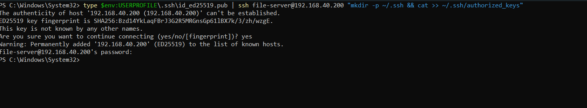

- **Server Hardening**:
Configuration: Modified /etc/ssh/sshd_config to set PasswordAuthentication no.

- **Verification & Validation**:
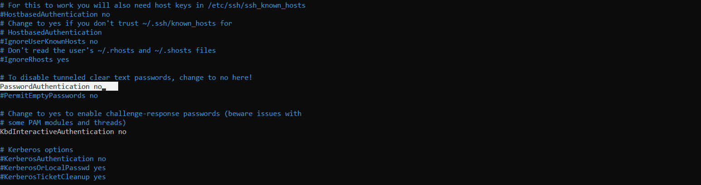

Result: 
This enforces exclusive key-based authentication, removing password-based access entirely and significantly reducing the attack surface against brute-force and credential-based attacks.

- **Validation**: Confirmed that the Windows 11 client can access the shell instantly after local passphrase decryption, while other unauthorized devices are denied at the protocol level.

- **Verification & Validation**:
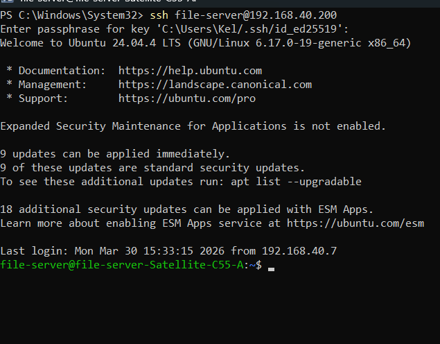

## Final Project Conclusion
This project demonstrates how legacy hardware can be repurposed into a reliable and secure file server.

### Key Achievements
- **Performance Optimization:** Improved responsiveness on limited hardware using ZRAM and memory tuning  
- **Resilient Networking:** Implemented dual-interface failover with static IP addressing  
- **Secure File Sharing:** Configured Samba with role-based access control  
- **Secure Remote Access:** Implemented SSH key-based authentication and disabled password logins  

### Operational Impact
The server can now be managed remotely in a secure and consistent manner, while providing reliable file access to clients on the network.

This project highlights practical skills in system administration, networking, troubleshooting, and security—aligned with real-world IT environments.


## Project Status: COMPLETED ✅

| Phase | Milestone | Status |
| :--- | :--- | :--- |
| Step 1 | OS Installation & Ventoy Boot | ✅ Complete |
| Step 2 | ZRAM & Performance Tuning | ✅ Complete |
| Step 3 | Static IP & Network Redundancy | ✅ Complete |
| Step 4 | Samba RBAC & Windows Mapping | ✅ Complete |
| Step 5 | SSH Key Hardening & Lockdown | ✅ Complete |